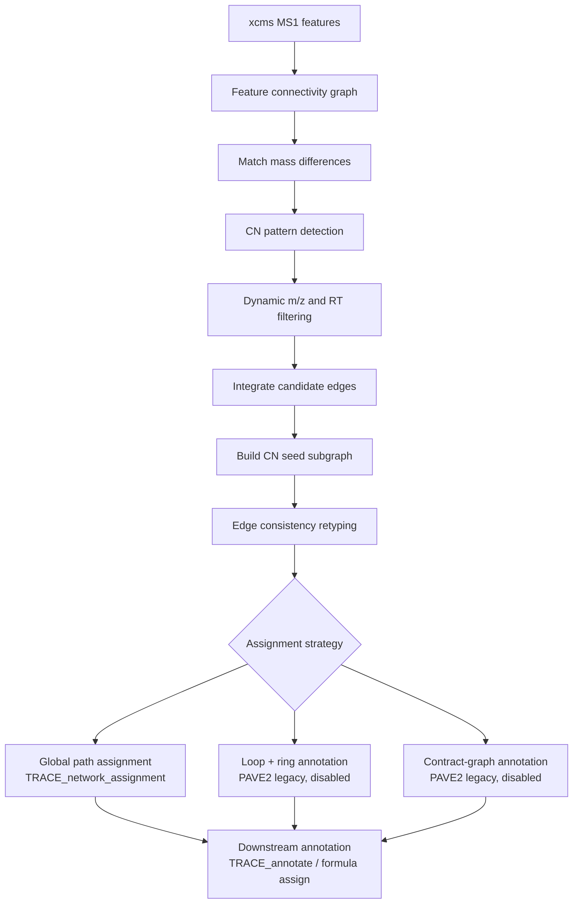
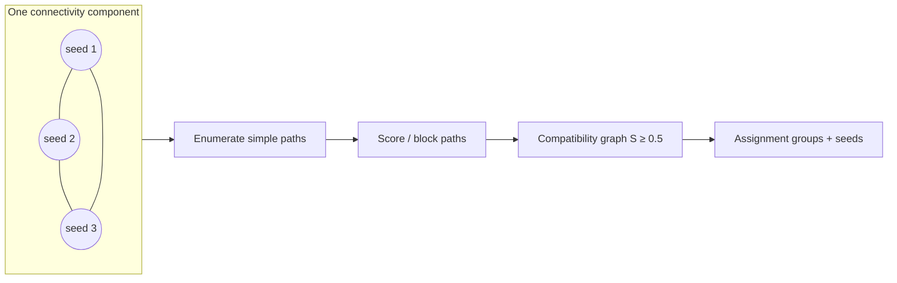

# Network Assignment Strategy (PAVE2)

This document describes the network assignment workflow implemented in `PAVE2()` (`R/TRACE_fun.R`). PAVE2 processes each polarity (Negative / Positive) and links CN-labeled xcms features into a metabolite network, then assigns each seed a role (metabolite, adduct, fragment, isotope) and a shared seed identifier.

The production TRACE pipeline refactors the global path-based strategy into `TRACE_network_assignment()` (`R/TRACE_workflow.R`, `R/TRACE_global_assignment.R`). PAVE2 still contains the original edge-validation logic and two legacy component-local annotation strategies (currently disabled with `if (F)`).

---

## High-level workflow



---

## Phase 1 — Network construction

### 1.1 Feature connectivity

For each polarity:

| Input | Parameter | Value |
|-------|-----------|-------|
| xcms data | `object@xcmsData[[paste0(pol,"MS1")]]` | — |
| RT tolerance | `rt.tol` | 10 s |
| Initial ppm | `ppm` | 10 |

`get_xcms_feature_connect()` builds `xcms.net`: pairs of features linked by co-elution (RT) and mass difference. Feature intensities are read with `featureValues(..., value = "maxo")`. PAVE samples are filtered to `S12C14N`, `S12C15N`, `S13C14N`, `S13C15N`, and `Blank`.

### 1.2 Theoretical mass-difference matching

Four lookup tables are matched against `xcms.net$mz.diff` via `match_mz_foverlaps()`:

| Type | Source | `type` label |
|------|--------|--------------|
| CN labeling | `get_CN_mass_diff_table(N_max = 10)` | `CN_label` |
| Adduct | `get_adduct_mass_diff(polarity)` | `adduct` |
| Isotope | `get_iso_mass_diff()` | `isotope` |
| Fragment | `get_fragment_mass_diff()` | `fragment` |

Only edges whose `mz.diff` falls within the combined mass-diff range are retained. Each match produces a typed sub-network (`cn.net`, `ad.net`, `is.net`, `fg.net`) with `mass_diff > 0`.

### 1.3 CN pattern detection

CN edges are annotated with `pave_pattern = paste0("C", C_count, "N", N_count)`.

Per seed feature (`from`):

1. **Prefilter** — keep seeds that have at least one edge with `N_count == 0` (unlabeled nitrogen reference).
2. **Enumerate C/N formulas** — all `(C, N)` pairs observed at that seed, bounded by `from.mz / 14`.
3. **Pattern completeness** — require all three forms present: `C0Ny`, `CxN0`, `CxNy` (excluding `C0N0`).
4. **PAVE correlation** — build intensity matrix across PAVE sample types, normalize to `C0N0` in `S12C14N`, correlate with `get_ideal_CN_ratio(C, N)`. Keep the `(C, N)` with highest correlation.
5. **Hit filter** — retain seeds with `pave_cor > 0.75`.

Result: `cn.net.hit` — CN-labeled seed features with assigned `pave_formula` (e.g. `C3N2`).

### 1.4 Dynamic error estimation and filtering

From CN-hit vs background edges in `cn.net`, `distinct_norm_from_random_backgroud()` fits a Gaussian mixture (signal vs KDE background) for:

- `mz.ppm` → `ppm.dyn = sd × qnorm(0.99)` (initial MAD estimate also computed)
- `rt.diff` → `rt.tol.dyn = sd × qnorm(0.99)`

**Filtering rules:**

| Network | Keep when |
|---------|-----------|
| `cn.net.hit` | Remove seeds where any edge has `\|mz.ppm\| > ppm.dyn` **or** `\|rt.diff\| > rt.tol.dyn` |
| `ad.net`, `is.net`, `fg.net` | Keep only edges with `\|mz.ppm\| < ppm.dyn` **and** `\|rt.diff\| < rt.tol.dyn` |

### 1.5 Candidate edge integration

`bind_rows(ad.net, is.net, cn.net.hit, fg.net)` → `xcms.net.candidate`:

- Simplify `chemform_diff` via `chemform_simplify()`.
- Deduplicate by `(ion1, chemform_diff)`, preferring edge types in order: **CN_label > fragment > adduct > isotope**.
- Assign sequential edge IDs (`eid`).

### 1.6 CN seed graph

- **Seeds** — unique `from` features in `cn.net.hit`.
- **Seed formulas** — `pave_formula` per seed.
- **Full graph** — `igraph::graph_from_data_frame(xcms.net.candidate)`; seed nodes colored red (`#E64B35`), others blue (`#97C2FC`).

---

## Phase 2 — Edge consistency retyping

Before assignment, seed–seed edges are re-evaluated in `### annotate CN seed network edge`.

The seed subgraph is extracted with `igraph_filter_vertex(xcms.ig, cn.seed)`.

For each edge, compute:

| Field | Meaning |
|-------|---------|
| `from.cn`, `to.cn` | Assigned `pave_formula` at endpoints |
| `cn.diff` | `chemform_calc(to.cn, from.cn, "-")` — net C/N label change between seeds |
| `cn.equal` | `cn.diff == ""` (no CN label change) |
| `chemform.equal` | C and N counts in `cn.diff` match those in `chemform_diff` |

**Retyping rules (`new.type`):**

| Original `type` | Condition | `new.type` |
|-----------------|-----------|------------|
| `adduct` | `cn.equal` | `adduct` |
| `adduct` | `!cn.equal` | `false` |
| `fragment` | `chemform.equal` | `fragment` |
| `fragment` | `!chemform.equal` | `false` |
| `isotope` | `chemform.equal` | `isotope` |
| `isotope` | `element == "[13]C"` and `cn.diff == "C-2"` | `isotope` |
| otherwise | — | `false` |

Edges labeled `false` are inconsistent with the assigned CN formulas and are removed before annotation. This step is **active** in PAVE2 and is mirrored in `.trace_retype_seed_edges()` for the TRACE refactor.

---

## Phase 3 — Assignment strategies

PAVE2 defines three assignment approaches. Only edge retyping (Phase 2) runs unconditionally; the two component-local strategies below are wrapped in `if (F)` and are not executed in the current PAVE2 build. The global path-based strategy was extracted into `TRACE_network_assignment()`.

---

### Strategy A — Global path-based assignment (production)

**Location:** `TRACE_network_assignment()` / `R/TRACE_global_assignment.R`  
**Status:** Refactored from PAVE2; called by `TRACE_workflow()`, not inside current `PAVE2()`.

This is the PAVE-style global assignment used in TRACE.

#### Step A.1 — Restrict to seed subgraph

Build `cn.seed.ig.full` from seed–seed edges only, after `.trace_retype_seed_edges()`.

#### Step A.2 — Partition by edge connectivity

`igraph::components(cn.seed.ig.full)` yields `conn.component` labels. Assignment runs independently within each connected component.

#### Step A.3 — Score all simple paths

For each node pair `(u, v)` within a component, enumerate all simple paths up to `max_path_length` (default **6**).

For a directed path `P = (v₁, …, v_L)`:

1. Orient each edge's `chemform_diff` along the path direction.
2. Sum element counts to a net formula change `Δform(P)`, collapsing isotope labels to the light-element basis.
3. **Block** the path (score = 0) if `Δform(P)` is non-empty and matches any theoretical adduct, fragment, or isotope entry in the MS mass-difference lookup.
4. Otherwise score:

```
s(P) = max(0, 1 − Σ|ε_ppm|/δ_ppm − Σ|Δt|/δ_rt)
```

where `δ_ppm` and `δ_rt` are dynamic tolerances (`σ̂ × Φ⁻¹(0.999)` and `σ̂ × Φ⁻¹(0.99999)`).

#### Step A.4 — Pairwise connection score

```
S(u, v) = max s(P)  over non-blocked simple paths from u to v
S(u, u) = 1
```

#### Step A.5 — Cluster into assignment groups

Build an undirected compatibility graph: edge between `u` and `v` when `S(u,v) ≥ θ` (default **θ = 0.5**) and the pair is not blocked. Connected components of this graph define **assignment groups**.

#### Step A.6 — Assign group labels and seeds

| Output | Rule |
|--------|------|
| `assign.group` | Component membership, prefixed by `conn.component` (e.g. `638.1`) |
| `assign.seed` | Minimum feature ID within each group |
| `TRACE_net_score` | Best connection score from a node to any other member of its group |

Output is stored in `object@advancedAna$TRACE_temp[[pol]]$cn.seed.assign`.



---

### Strategy B — Component-local loop annotation (PAVE2 legacy)

**Location:** `PAVE2()` lines ~418–604  
**Status:** Disabled (`if (F)`)

Annotates each connected component of the filtered seed graph without global path scoring.

#### Step B.1 — Prepare subgraph

1. Filter `xcms.ig` to CN seeds.
2. Remove edges with `new.type == "false"`.
3. Split vertices by `get_igraph_membership()` → `cn.seed.split`.

#### Step B.2 — Singleton component

If the component has one node:

| Field | Value |
|-------|-------|
| `pave_MS_form` | `"Undefined"` |
| `pave_seed` | `paste0("CN_Seed_", name)` |
| `pave_formula` | seed's `pave_formula` |

#### Step B.3 — Ring detection (cycles of length 3–4)

For multi-node components, find simple cycles with `igraph::simple_cycles(min = 3, max = 4)`.

For each cycle:

1. Orient edge `chemform_diff` along the cycle (`get_path_direction()`).
2. Compute cumulative formula sums along the cycle; remove isotope labels (`chemform_remove_iso`) and simplify.
3. **Valid ring** — every cumulative form appears in `fg.mass.diff$chemform_diff` or `ad.mass.diff$chemform_diff`.
4. For valid rings, derive per-vertex MS forms with `get_pave_ig_vertex_form()`:

```
pave_MS_form = paste(isotope, adduct, fragment, sep = ";")
```

5. Group vertices with equivalent forms via `ring.node.form.group()` (pairwise `;`-split field comparison).
6. Assign `pave_seed` per cluster: `CN_Seed_{min(node ID in cluster)}`.

#### Step B.4 — Fallback (no valid ring)

1. **Seed selection:**
   - If all edges are `fragment` → seed = `to` of first edge.
   - Else → seed = minimum node ID in the subgraph with fragment edges removed.
2. **MS form** — `get_pave_ig_vertex_form()`, take the first form per node.

#### Step B.5 — Annotation categories

| `pave_annotation` | Rule |
|-------------------|------|
| `isotope` | `pave_MS_form` starts with `[` |
| `CN_metabolite` | `pave_seed == paste0("CN_Seed_", name)` |
| `Unknow_adduct` | `pave_seed` is `NA` |
| `fragment` | `pave_MS_form` does not end with `;` |
| `adduct` | default |

#### Step B.6 — Expand to CN-labeled peaks

`cn.exp` propagates seed annotation to CN-labeled daughter features (`cn.net.hit$to`), setting `pave_pattern` to the observed labeling pattern (e.g. `C0N0`, `C3N2`).

Result: `cn.peaks.annotation.df` = seed annotations + expanded CN peaks.

---

### Strategy C — Contract-graph adduct filtering (PAVE2 legacy)

**Location:** `PAVE2()` lines ~607–725  
**Status:** Disabled (`if (F)`)

An alternative to ring detection that resolves ambiguous adduct edges by graph contraction.

#### Step C.1 — Graph contraction

`pave_igraph_contract(i.cn.seed.ig)`:

1. Build membership on the subgraph **excluding adduct edges**.
2. Relabel vertices and call `igraph::contract()` to merge parallel/redundant nodes.
3. Non-adduct connectivity determines which features collapse together.

#### Step C.2 — Degenerate case

If the contracted graph has no edges between distinct nodes (`nrow(eda) == 0`), fall back to **Strategy B Step B.4** (seed selection + `get_pave_ig_vertex_form`).

#### Step C.3 — Adduct edge voting

When contracted edges remain:

1. For each vertex, tabulate incident `adduct.from` / `adduct.to` labels.
2. Compute per-edge `ratio = freq / degree` (singleton degree → ratio 0.5).
3. **Keep** edges where `mean_f(ratio, eid) > 0.5`; **remove** edges with ratio ≤ 0.5.
4. Re-visualize / re-annotate the pruned subgraph.

> Note: This block does not complete a full annotation table in the current code; edge pruning is the main contribution. Downstream annotation would follow Strategy B logic on the pruned graph.

---

### Strategy D — Formula assignment (stub)

**Location:** `PAVE2()` lines ~728–736  
**Status:** Incomplete

Loads the compound database (`CompoundDb::CompDb(cpdb_path)`) and xcms feature definitions. Intended to assign chemical formulas to annotated seeds; not fully implemented in `PAVE2()`. Formula assignment is handled in `TRACE_annotate()` in the refactored pipeline.

---

## Phase 4 — Output

| Object slot | Content |
|-------------|---------|
| `object@advancedAna$PAVE2[[pol]]` | `cn.peaks.annotation.df` (when annotation strategy runs) |
| `object@advancedAna$PAVE2_temp[[pol]]$CNfinder` | All CN edges with optional `pave_cor` |
| `object@advancedAna$PAVE2_temp[[pol]]$mz.dyn` / `rt.dyn` | Dynamic tolerance fits |
| `object@advancedAna$TRACE_temp[[pol]]$cn.seed.assign` | Global assignment (TRACE pipeline) |

---

## Key helper functions

| Function | File | Role |
|----------|------|------|
| `get_pave_ig_vertex_form()` | `R/dev_chem.R` | Summarize isotope / adduct / fragment labels per vertex from incident edges |
| `ring.node.form.group()` | `R/dev_chem.R` | Cluster vertices with equivalent MS forms on a ring |
| `pave_igraph_contract()` | `R/dev_chem.R` | Contract graph by non-adduct connectivity |
| `distinct_norm_from_random_backgroud()` | `R/TRACE_fun.R` | EM mixture for dynamic ppm / RT cutoffs |
| `.trace_run_global_assignment()` | `R/TRACE_global_assignment.R` | Global path scoring and clustering |
| `TRACE_network_assignment()` | `R/TRACE_workflow.R` | Exported entry point for Strategy A |

---

## Strategy comparison

| Aspect | Strategy A (Global) | Strategy B (Loop) | Strategy C (Contract) |
|--------|---------------------|-------------------|------------------------|
| Scope | Whole connectivity component | Per component, per cycle | Per component, adduct edges |
| Path evaluation | All simple paths (≤ 6 hops) | Cycle paths only (3–4) | None (edge frequency) |
| Blocking | Net formula matches MS lookup | Cumulative ring formulas in lookup | Adduct ratio ≤ 0.5 |
| Seed selection | Min ID per compatibility group | Min ID per form cluster / subgraph | Inherited from B fallback |
| Status in PAVE2 | Extracted to TRACE | Disabled | Disabled |
| False-positive control | Path blocking + connection cutoff | CN/fragment/isotope edge retyping | Adduct edge pruning |

---

## Recommended usage

For new analyses, run the TRACE workflow:

```r
object <- TRACE_CN_finder(object, i.pol = 0)
object <- TRACE_dynamic_filter(object, i.pol = 0)
object <- TRACE_network_assignment(object, i.pol = 0)
object <- TRACE_annotate(object, i.pol = 0, cpdb = "...")
```

`PAVE2()` remains useful as a reference implementation of CN detection and documents the evolutionary path from component-local (Strategies B/C) to global path-based assignment (Strategy A).
